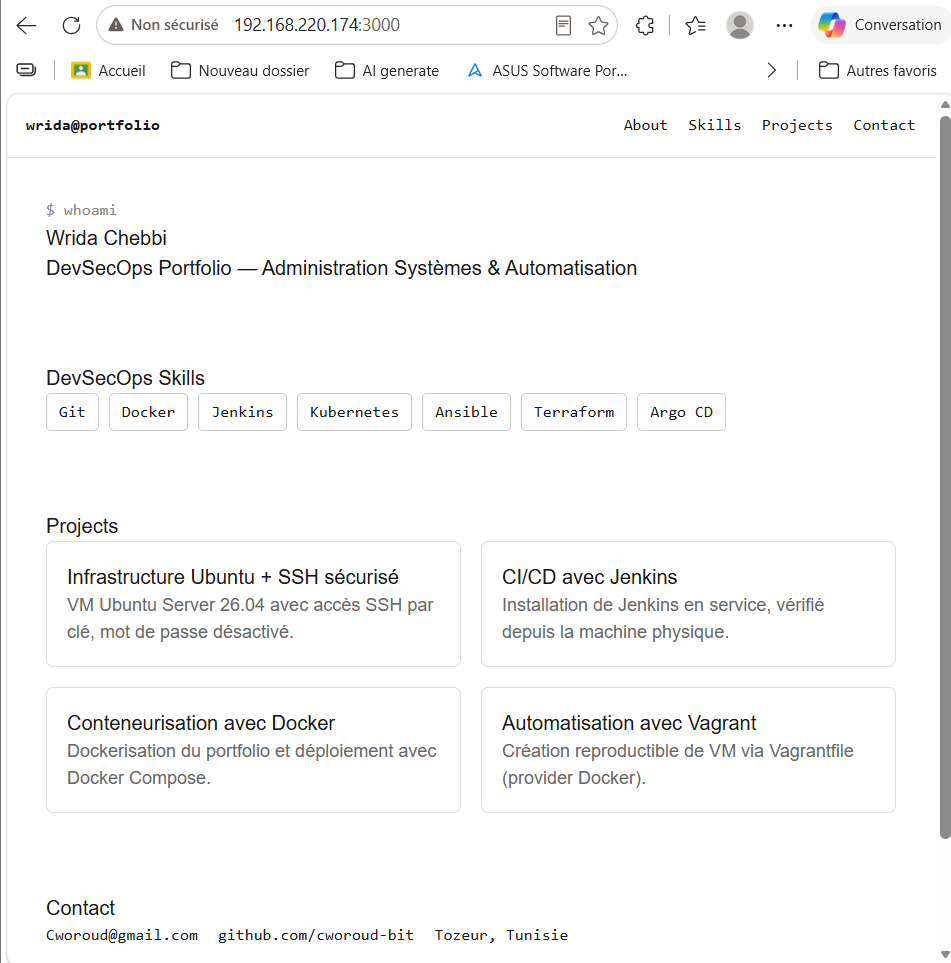
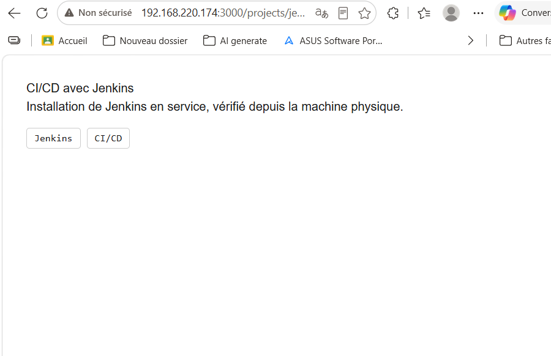
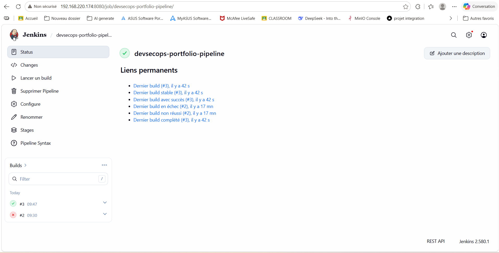
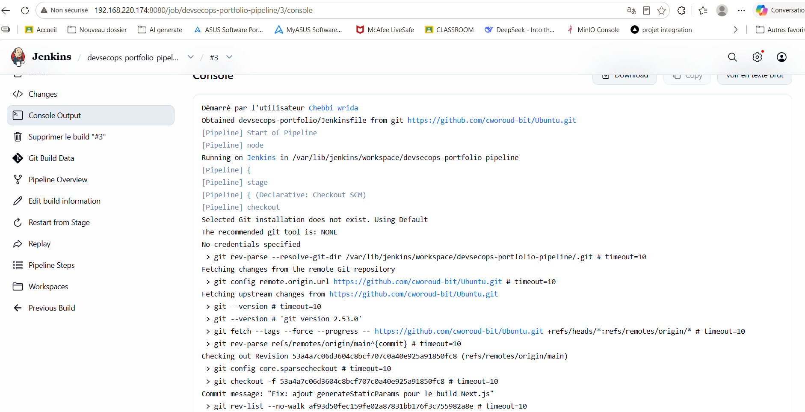
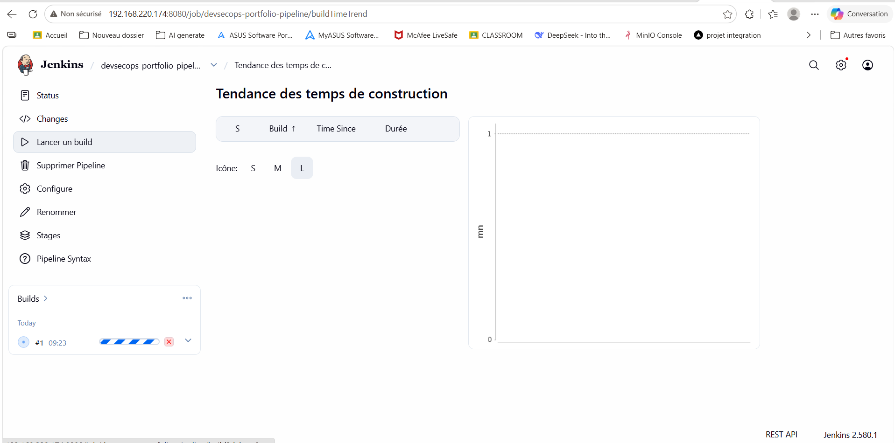

# Migration Next.js & Premier Pipeline Jenkins

Ce document couvre la migration du DevSecOps Portfolio vers Next.js
(composants réutilisables, données séparées, pages dynamiques) ainsi
que la mise en place d'un premier pipeline Jenkins pour ce projet.

---

## 18. Migration du Portfolio vers Next.js

### Commande de création du projet
```bash
npx create-next-app@latest devsecops-portfolio --js --eslint --tailwind --no-src-dir --app --import-alias "@/*"
```

Les mêmes sections que la version HTML/CSS/JS (About, Skills, Projects,
Contact) sont conservées dans cette nouvelle version Next.js, avec le
même style visuel (thème terminal).

### Lancer l'application en développement
```bash
cd devsecops-portfolio
npm run dev -- -H 0.0.0.0
```
Accès depuis la machine physique : `http://192.168.220.174:3000`

### Capture d'écran


---

## 19. Composants réutilisables

Les sections du portfolio ont été extraites en composants React
indépendants, assemblés dans `app/page.js`.

### Structure des composants
```
devsecops-portfolio/
├── app/
│   ├── page.js              # Assemble tous les composants
│   └── projects/
│       ├── page.js           # Liste des projets
│       └── [slug]/page.js    # Détail d'un projet
├── components/
│   ├── Header.jsx
│   ├── About.jsx
│   ├── Skills.jsx
│   ├── Projects.jsx
│   ├── Contact.jsx
│   └── Footer.jsx
└── data/
    ├── skills.js
    └── projects.js
```

### Exemple : `app/page.js`
```jsx
import Header from "../components/Header";
import About from "../components/About";
import Skills from "../components/Skills";
import Projects from "../components/Projects";
import Contact from "../components/Contact";
import Footer from "../components/Footer";

export default function Home() {
  return (
    <>
      <Header />
      <About />
      <Skills />
      <Projects />
      <Contact />
      <Footer />
    </>
  );
}
```

---

## 20. Fichiers de données séparés

Les informations de projets et de compétences ne sont plus codées en
dur dans les composants, mais importées depuis des fichiers de données
dédiés.

### Exemple : `data/skills.js`
```javascript
export const skills = [
  "Git", "Docker", "Jenkins", "Kubernetes", "Ansible", "Terraform", "Argo CD"
];
```

### Exemple : `data/projects.js`
```javascript
export const projects = [
  {
    slug: "infra-ssh",
    title: "Infrastructure Ubuntu + SSH sécurisé",
    description: "VM Ubuntu Server 26.04 avec accès SSH par clé, mot de passe désactivé.",
    tags: ["Ubuntu", "SSH"]
  },
  {
    slug: "jenkins-cicd",
    title: "CI/CD avec Jenkins",
    description: "Installation de Jenkins en service, vérifié depuis la machine physique.",
    tags: ["Jenkins", "CI/CD"]
  },
  {
    slug: "docker-portfolio",
    title: "Conteneurisation avec Docker",
    description: "Dockerisation du portfolio et déploiement avec Docker Compose.",
    tags: ["Docker", "Nginx"]
  },
  {
    slug: "vagrant-automation",
    title: "Automatisation avec Vagrant",
    description: "Création reproductible de VM via Vagrantfile (provider Docker).",
    tags: ["Vagrant", "IaC"]
  }
];
```

---

## 21. Pages dédiées aux projets

Routes créées :
- `/projects` : liste de tous les projets
- `/projects/[slug]` : page de détail générée dynamiquement pour chaque projet

### `app/projects/[slug]/page.js`
```jsx
import { projects } from "../../../data/projects";
import { notFound } from "next/navigation";

export function generateStaticParams() {
  return projects.map((p) => ({ slug: p.slug }));
}

export default async function ProjectDetail({ params }) {
  const { slug } = await params;
  const project = projects.find((p) => p.slug === slug);
  if (!project) return notFound();

  return (
    <main>
      <h1>{project.title}</h1>
      <p>{project.description}</p>
      <div className="tags">
        {project.tags.map((t) => <span key={t}>{t}</span>)}
      </div>
    </main>
  );
}
```

> La fonction `generateStaticParams()` est indispensable : sans elle,
> le build de production (`next build`) échoue car Next.js ne sait pas
> à l'avance quelles pages `[slug]` générer de façon statique.

### Captures d'écran



---

## 22. Premier pipeline Jenkins (checkout GitHub)

### Jenkinsfile
```groovy
pipeline {
    agent any

    stages {
        stage('Checkout') {
            steps {
                git branch: 'main',
                    url: 'https://github.com/cworoud-bit/Ubuntu.git'
            }
        }

        stage('Install Dependencies') {
            steps {
                dir('devsecops-portfolio') {
                    sh 'npm install'
                }
            }
        }

        stage('Build') {
            steps {
                dir('devsecops-portfolio') {
                    sh 'npm run build'
                }
            }
        }
    }
}
```

### Configuration du job Jenkins
- Type : **Pipeline**
- Definition : `Pipeline script from SCM`
- SCM : Git — `https://github.com/cworoud-bit/Ubuntu.git`
- Branch : `*/main`
- Script Path : `devsecops-portfolio/Jenkinsfile`

### Capture d'écran


---

## 23. Installation des dépendances dans le pipeline

L'étape `Install Dependencies` exécute `npm install` à l'intérieur du
sous-dossier `devsecops-portfolio/` (le `Jenkinsfile` se trouve à la
racine du dépôt, mais le projet Next.js est dans un sous-dossier, d'où
l'utilisation de `dir('devsecops-portfolio') { ... }`).

### Capture d'écran


---

## 24. Build automatique de l'application Next.js

### Problème rencontré et résolu
Le premier build a échoué avec l'erreur suivante lors du pré-rendu de
la page dynamique `/projects/[slug]` :
```
Error occurred prerendering page "/projects/[slug]"
Export encountered an error on /projects/[slug]/page
```

**Cause** : sans `generateStaticParams()`, Next.js ne sait pas combien
de pages générer pour la route dynamique `[slug]` lors d'un build de
production.

**Solution** : ajout de `generateStaticParams()` dans
`app/projects/[slug]/page.js` (voir point 21), qui retourne la liste
des `slug` à partir du fichier `data/projects.js`.

### Résultat après correction
```
✓ Compiled successfully in 10.6s
✓ Generating static pages using 1 worker (10/10)

Route (app)
┌ ○ /
├ ○ /_not-found
├ ○ /projects
└   /projects/[slug]
  ├ ◐ /projects/[slug]
  ├ ○ /projects/infra-ssh
  ├ ○ /projects/jenkins-cicd
  └ ◐ [+2 more paths]
```

### Capture d'écran


---

## Résumé de cette partie

| # | Tâche | Statut |
|---|---|---|
| 18 | Migration du Portfolio vers Next.js | ✅ |
| 19 | Composants réutilisables (Header, About, Skills, Projects, Contact, Footer) | ✅ |
| 20 | Données séparées (skills.js, projects.js) | ✅ |
| 21 | Pages /projects et /projects/[slug] | ✅ |
| 22 | Premier pipeline Jenkins (checkout GitHub) | ✅ |
| 23 | Installation des dépendances dans le pipeline | ✅ |
| 24 | Build automatique de l'application Next.js | ✅ |

## Environnement technique (complément)

* **Framework** : Next.js 16.4.0 (App Router, Turbopack)
* **Node.js** : installé via NodeSource (LTS)
* **Emplacement du projet** : `mon-cv/devsecops-portfolio/` (sous-dossier du dépôt principal)
* **Pipeline Jenkins** : `devsecops-portfolio-pipeline`, script depuis SCM
