# Projet DevOps — Ubuntu Server, SSH, Docker, Jenkins & DevSecOps Portfolio

Ce projet documente la mise en place d'un environnement Linux sécurisé
(VM Ubuntu Server 26.04), l'installation de services (Docker, Jenkins),
ainsi que la création, l'évolution et la dockerisation d'un portfolio
DevSecOps avec Git/GitHub.

---

## 1. Installation d'Ubuntu Server 26.04

Installation réalisée sur VMware Workstation avec :
- Serveur OpenSSH installé pendant l'installation (option "Install OpenSSH server")
- Partitionnement LVM par défaut

---

## 2. Configuration de l'accès SSH sécurisé

### Étapes réalisées

1. Génération d'une paire de clés SSH sur la machine physique (Windows) :
   ```powershell
   ssh-keygen -t ed25519
   ```

2. Copie de la clé publique vers la VM :
   ```powershell
   type $env:USERPROFILE\.ssh\id_ed25519.pub | ssh wrida@192.168.220.174 "mkdir -p ~/.ssh && cat >> ~/.ssh/authorized_keys"
   ```

3. Durcissement de la configuration SSH (`/etc/ssh/sshd_config`) :
   ```
   PasswordAuthentication no
   PubkeyAuthentication yes
   ```
   ```bash
   sudo systemctl restart ssh
   ```

### Test de connexion depuis la machine physique
```powershell
ssh wrida@192.168.220.174
```

### Résultat
Connexion établie uniquement par authentification par clé publique/privée.
L'authentification par mot de passe est désactivée, empêchant toute
tentative de connexion par force brute.

### Captures d'écran
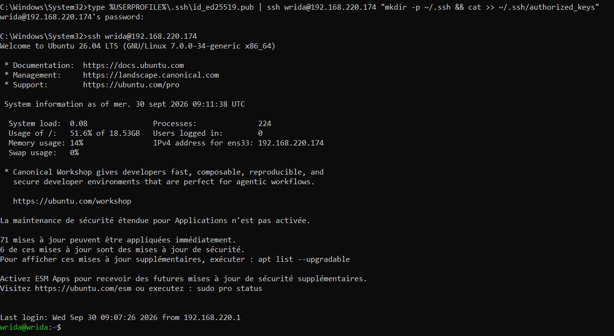
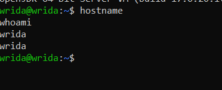

---

## 3. Installation de Docker

### Étapes réalisées
```bash
sudo apt update
sudo apt install ca-certificates curl gnupg -y
sudo install -m 0755 -d /etc/apt/keyrings
curl -fsSL https://download.docker.com/linux/ubuntu/gpg | sudo gpg --dearmor -o /etc/apt/keyrings/docker.gpg
echo "deb [arch=$(dpkg --print-architecture) signed-by=/etc/apt/keyrings/docker.gpg] https://download.docker.com/linux/ubuntu $(. /etc/os-release && echo $VERSION_CODENAME) stable" | sudo tee /etc/apt/sources.list.d/docker.list
sudo apt update
sudo apt install docker-ce docker-ce-cli containerd.io docker-compose-plugin -y
sudo usermod -aG docker $USER
```

### Vérification
```bash
docker --version
sudo systemctl status docker
sudo docker run hello-world
```

### Résultat
- Docker version 29.8.1
- Service actif (`active (running)`) et activé au démarrage (`enabled`)
- Message "Hello from Docker!" confirmant le bon fonctionnement

### Captures d'écran
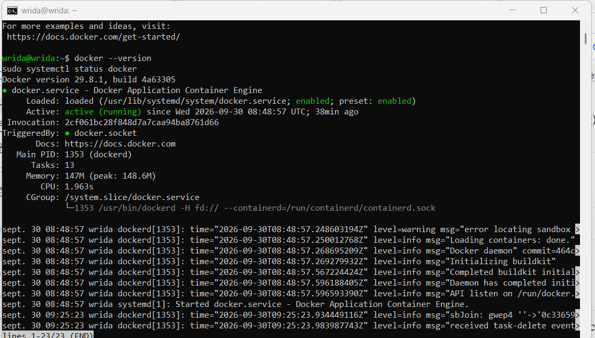
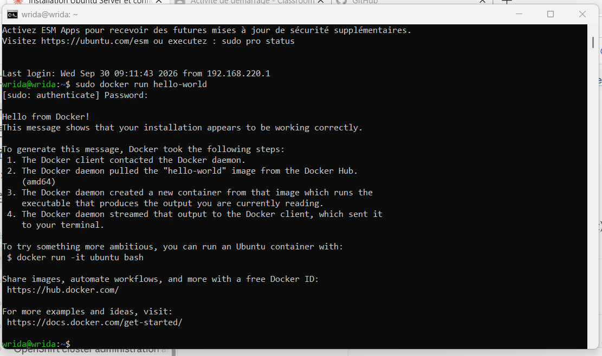

---

## 4. Installation de Jenkins en tant que service

### Étapes réalisées
```bash
# Java (prérequis)
sudo apt install openjdk-21-jre -y

# Clé GPG Jenkins (clé 2026, mise à jour officielle)
curl -fsSL https://pkg.jenkins.io/debian-stable/jenkins.io-2026.key | sudo tee /usr/share/keyrings/jenkins-keyring.asc > /dev/null

# Dépôt Jenkins
echo "deb [signed-by=/usr/share/keyrings/jenkins-keyring.asc] https://pkg.jenkins.io/debian-stable binary/" | sudo tee /etc/apt/sources.list.d/jenkins.list

sudo apt update
sudo apt install jenkins -y

# Service
sudo systemctl start jenkins
sudo systemctl enable jenkins

# Pare-feu
sudo ufw allow 8080/tcp
```

### Vérification du service
```bash
sudo systemctl status jenkins
```
Résultat : service actif (`active (running)`) et activé au démarrage.

### Vérification depuis la machine physique
Accès via navigateur à l'adresse : `http://192.168.220.174:8080`

Jenkins version 2.580.1 accessible et fonctionnel, avec le dashboard
"Bienvenue sur Jenkins !" confirmant une installation complète et réussie.

### Captures d'écran
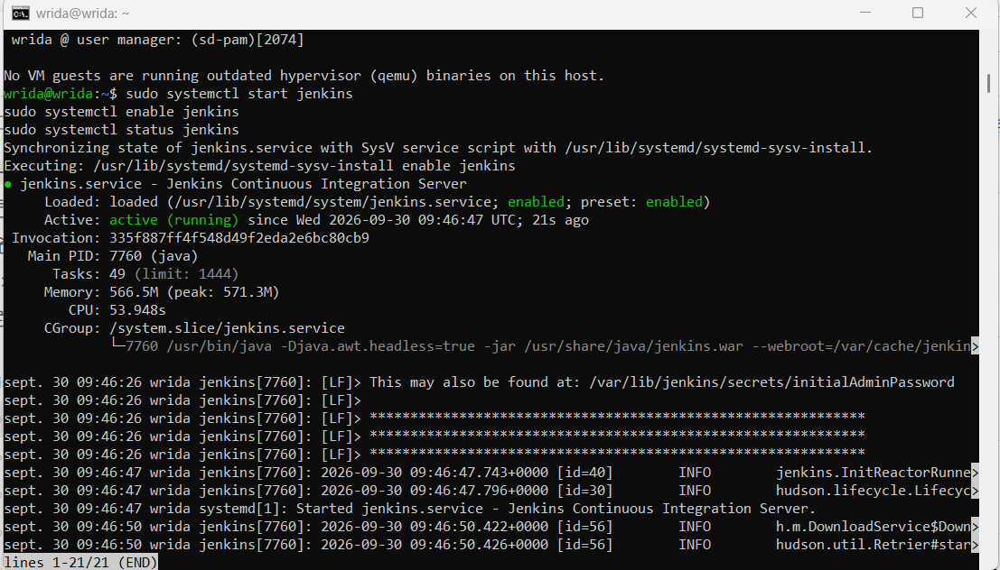
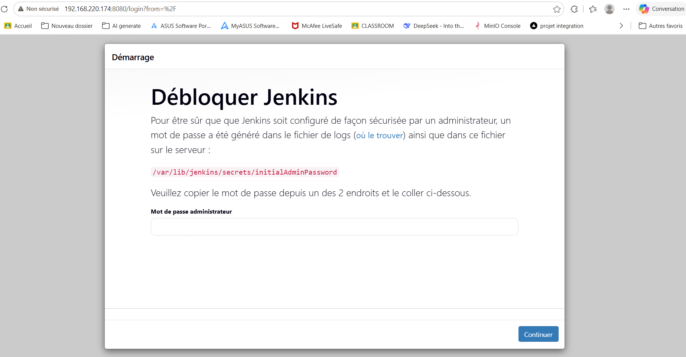
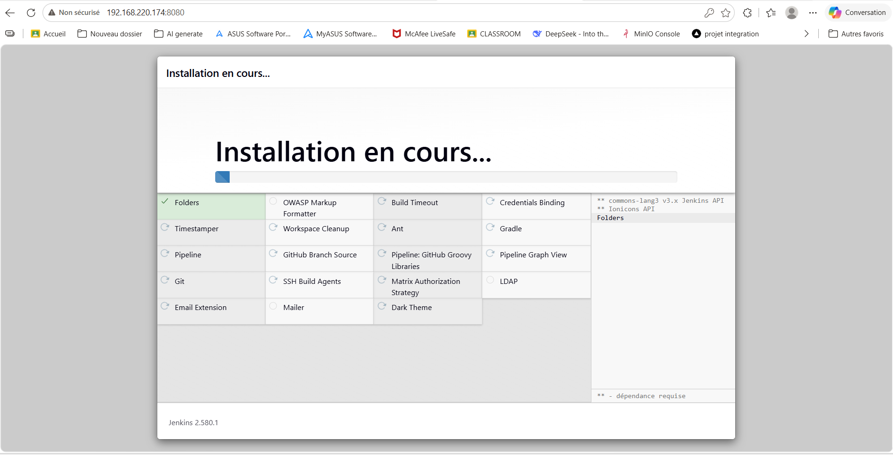

---

## 5. Mini CV One Page (HTML5/CSS3/JavaScript)

Un CV personnel sur une seule page, en fichier HTML autonome (CSS et
JavaScript intégrés dans le même fichier), avec un thème inspiré du
terminal (cohérent avec le contenu du projet : Linux, Docker, Jenkins, SSH).

### Lien GitHub
🔗 https://github.com/cworoud-bit/Ubuntu

### Lien GitHub Pages (site en ligne)
🔗 https://cworoud-bit.github.io/Ubuntu/

### Capture d'écran
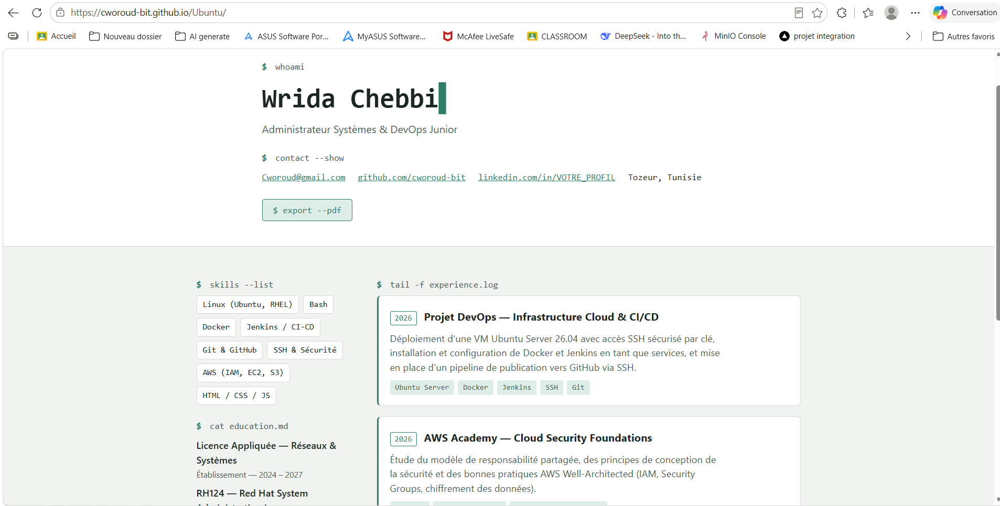

---

## 6. Activation des push GitHub via SSH

### Étapes réalisées

1. Génération d'une clé SSH sur la VM (dédiée à GitHub) :
   ```bash
   ssh-keygen -t ed25519 -C "Cworoud@gmail.com"
   ```

2. Affichage et copie de la clé publique :
   ```bash
   cat ~/.ssh/id_ed25519.pub
   ```

3. Ajout de la clé sur GitHub :
   - GitHub → Settings → SSH and GPG keys → New SSH key
   - Nom : `VM ubuntu`
   - Collage de la clé publique → Add SSH key

4. Test de la connexion SSH :
   ```bash
   ssh -T git@github.com
   ```
   Résultat :
   ```
   Hi cworoud-bit! You've successfully authenticated, but GitHub does not provide shell access.
   ```

5. Configuration du dépôt local pour utiliser SSH :
   ```bash
   git remote set-url origin git@github.com:cworoud-bit/Ubuntu.git
   ```

6. Push réussi :
   ```bash
   git add .
   git commit -m "CV en fichier HTML unique autonome"
   git push -u origin main
   ```

### Captures d'écran
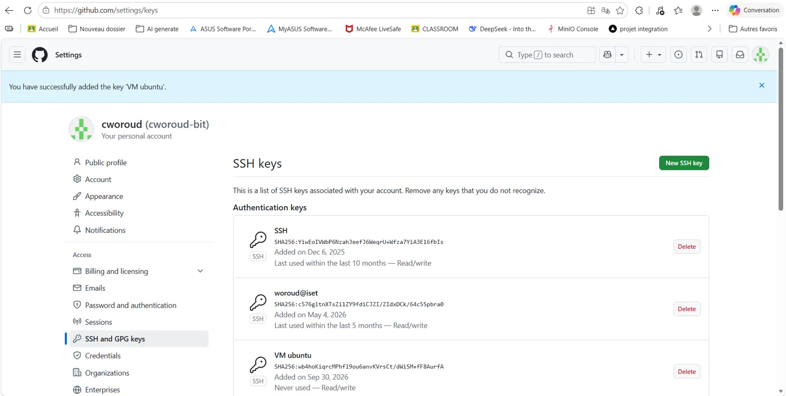
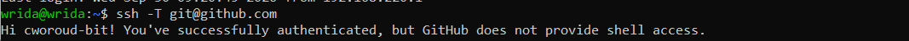
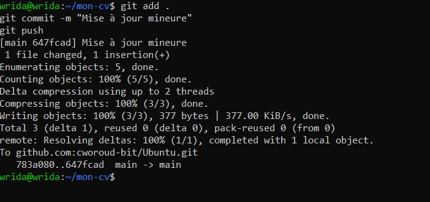

---

## 7. Évolution du mini CV vers DevSecOps Portfolio

Le mini CV initial a été restructuré en portfolio avec une navigation par
ancre et 5 sections : **About, Skills, Projects, Experience, Contact**.

### Principales améliorations
- Navbar fixe avec liens de navigation vers chaque section
- Section Skills avec badges technologiques (style terminal)
- Section Projects générée dynamiquement en JavaScript à partir d'un
  tableau d'objets (plutôt que du HTML statique)
- Section Experience sous forme de "log" chronologique
- Design toujours responsive (mobile/desktop), thème terminal conservé
  pour la cohérence visuelle avec le reste du projet

### Capture d'écran
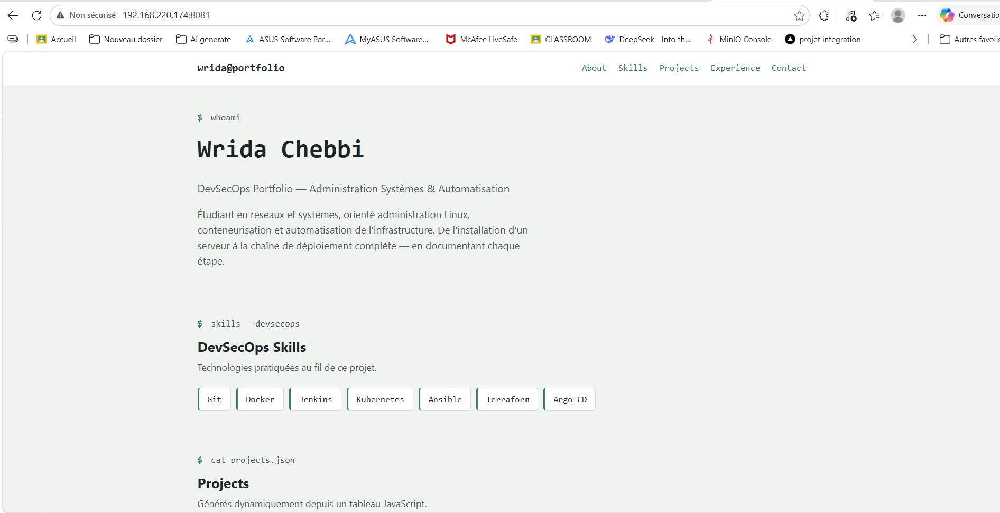

---

## 8. Section DevSecOps Skills

Affichage des technologies pratiquées pendant le projet, sous forme de
badges générés dynamiquement en JavaScript :

```javascript
const skills = ["Git","Docker","Jenkins","Kubernetes","Ansible","Terraform","Argo CD"];
const skillsList = document.getElementById("skills-list");
skills.forEach(s => {
  const el = document.createElement("span");
  el.className = "skill-badge";
  el.textContent = s;
  skillsList.appendChild(el);
});
```

### Capture d'écran
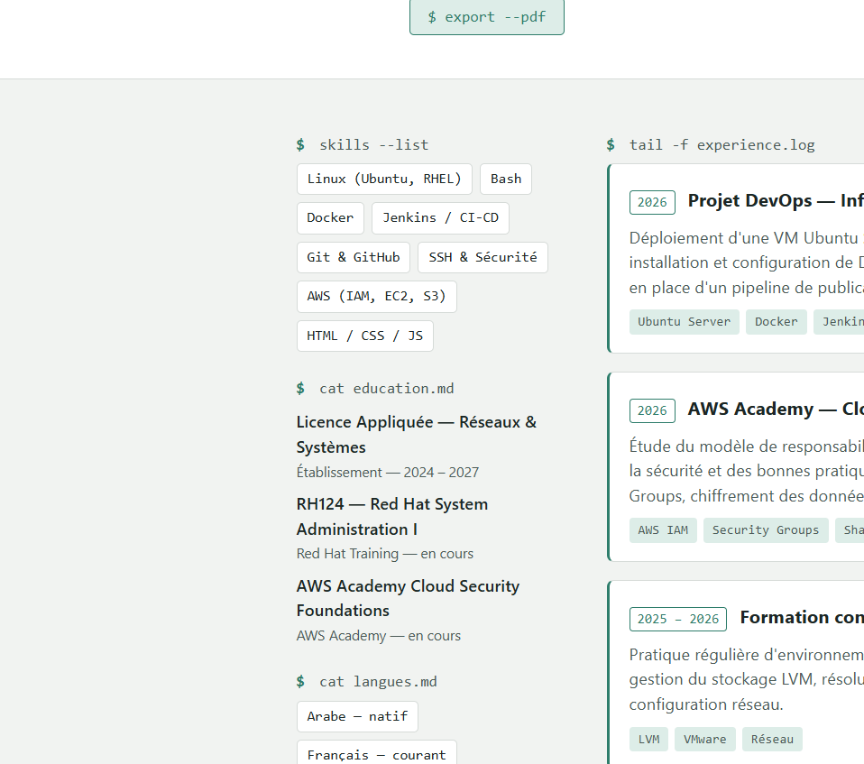

---

## 9. Section Projects générée dynamiquement en JavaScript

### Extrait de code
```javascript
const projects = [
  {
    title: "Infrastructure Ubuntu + SSH sécurisé",
    description: "VM Ubuntu Server 26.04 avec accès SSH par clé, mot de passe désactivé.",
    tags: ["Ubuntu", "SSH"]
  },
  {
    title: "CI/CD avec Jenkins",
    description: "Installation de Jenkins en service, vérifié depuis la machine physique.",
    tags: ["Jenkins", "CI/CD"]
  },
  {
    title: "Conteneurisation avec Docker",
    description: "Dockerisation du portfolio et déploiement avec Docker Compose.",
    tags: ["Docker", "Nginx"]
  },
  {
    title: "Automatisation avec Vagrant",
    description: "Création reproductible de VM via Vagrantfile.",
    tags: ["Vagrant", "IaC"]
  }
];

const projectsList = document.getElementById("projects-list");
projects.forEach(p => {
  const card = document.createElement("div");
  card.className = "project-card";
  card.innerHTML = `
    <h3>${p.title}</h3>
    <p>${p.description}</p>
    <div class="tags">${p.tags.map(t => `<span>${t}</span>`).join("")}</div>
  `;
  projectsList.appendChild(card);
});
```

### Capture d'écran
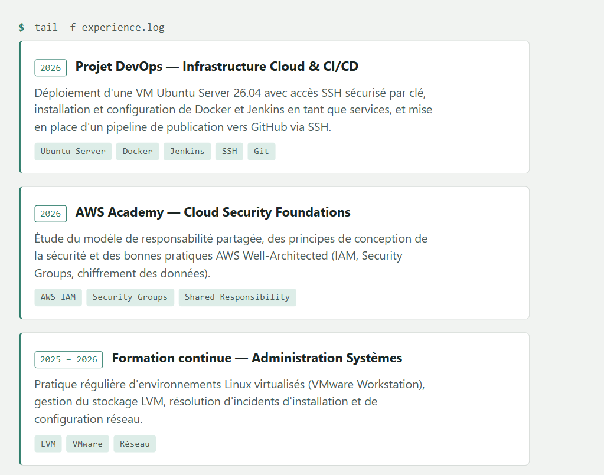

---

## 10. Dockerfile

```dockerfile
FROM nginx:alpine

COPY index.html /usr/share/nginx/html/index.html

EXPOSE 80

CMD ["nginx", "-g", "daemon off;"]
```

### Explication
Image légère basée sur `nginx:alpine`, qui copie le fichier HTML du
portfolio dans le dossier racine web de Nginx (`/usr/share/nginx/html/`)
et expose le port 80 pour servir le site.

---

## 11. Construction de l'image Docker `cv-docker`

### Commande utilisée
```bash
docker build -t cv-docker .
```

### Résultat
```
cv-docker:latest     1c8c3651bab9       93.6MB
```

### Capture d'écran
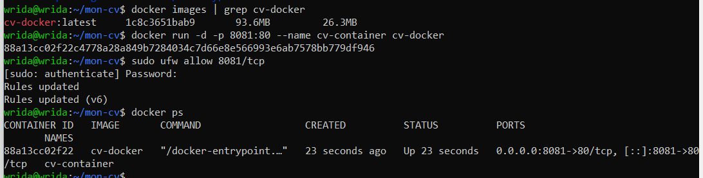

---

## 12. Exécution du conteneur

### Commande utilisée
```bash
docker run -d -p 8081:80 --name cv-container cv-docker
sudo ufw allow 8081/tcp
```

### Résultat `docker ps`
```
CONTAINER ID   IMAGE       COMMAND                  PORTS                     NAMES
88a13cc02f22   cv-docker   "/docker-entrypoint.…"   0.0.0.0:8081->80/tcp      cv-container
```

Accès vérifié depuis la machine physique : `http://192.168.220.174:8081`

### Capture d'écran
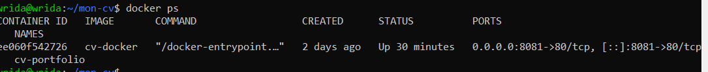

---

## 13. Déploiement avec Docker Compose

### docker-compose.yml
```yaml
services:
  portfolio:
    build: .
    image: cv-docker
    container_name: cv-portfolio
    ports:
      - "8081:80"
    restart: unless-stopped
```

### Commande utilisée
```bash
docker compose up -d
docker compose ps
```

### Résultat
```
NAME           IMAGE       STATUS                  PORTS
cv-portfolio   cv-docker   Up Less than a second   0.0.0.0:8081->80/tcp
```

### Capture d'écran
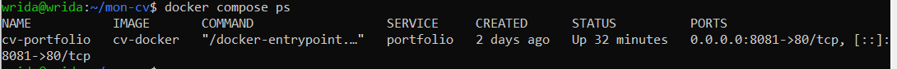

---

## 14. Publication des modifications sur GitHub via SSH

### Commandes utilisées
```bash
git add .
git commit -m "Évolution en DevSecOps Portfolio + Dockerisation (Dockerfile, docker-compose)"
git push
```

### Dépôt GitHub mis à jour
🔗 https://github.com/cworoud-bit/Ubuntu


## 15. Installation de Vagrant + Vagrantfile

⚠️ Note : la virtualisation imbriquée (nested virtualization) n'étant pas
supportée par la plateforme physique (Hyper-V actif sur l'hôte Windows
empêchant VT-x/EPT), le provider **Docker** a été utilisé à la place de
VirtualBox pour Vagrant.

### Installation de Vagrant
\`\`\`bash
wget -O- https://apt.releases.hashicorp.com/gpg | sudo gpg --dearmor -o /usr/share/keyrings/hashicorp-archive-keyring.gpg
echo "deb [signed-by=/usr/share/keyrings/hashicorp-archive-keyring.gpg] https://apt.releases.hashicorp.com $(lsb_release -cs) main" | sudo tee /etc/apt/sources.list.d/hashicorp.list
sudo apt update
sudo apt install vagrant -y
\`\`\`
Résultat : Vagrant 2.4.9

### Vagrantfile (provider Docker)
\`\`\`ruby
Vagrant.configure("2") do |config|
  config.vm.define "ubuntu-vagrant" do |node|
    node.vm.provider "docker" do |d|
      d.image = "rastasheep/ubuntu-sshd:18.04"
      d.has_ssh = true
    end
    node.ssh.username = "root"
    node.ssh.password = "root"
    node.ssh.insert_key = false
  end
end
\`\`\`

### Commande
\`\`\`bash
vagrant up
\`\`\`

### Capture d'écran
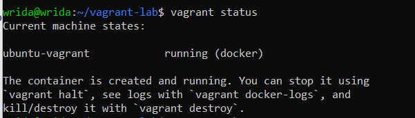

---

## 16. Connexion avec vagrant ssh

\`\`\`bash
vagrant ssh
\`\`\`

### Capture d'écran
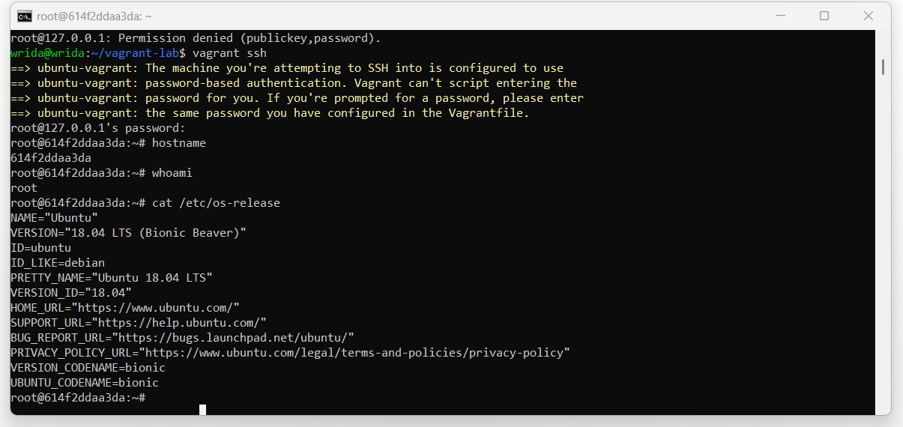

### Comparaison avec la création manuelle de VM

| Critère | Création manuelle (VMware) | Vagrant |
|---|---|---|
| Temps de mise en place | Long (ISO, partitionnement, installation OS complète) | Rapide (une seule commande `vagrant up`) |
| Reproductibilité | Manuelle, difficile à refaire à l'identique | Automatique via le Vagrantfile versionnable |
| Configuration SSH | À faire manuellement à chaque fois | Définie une fois dans le Vagrantfile |
| Documentation | Nécessite de noter chaque étape séparément | Le Vagrantfile **est** la documentation |
| Cas d'usage | Apprentissage approfondi de l'installation OS | Tests rapides, environnements jetables, CI/CD |
| Contrainte rencontrée | — | Nested virtualization indisponible → provider Docker utilisé comme alternative à VirtualBox |
---

## Résumé du projet

| # | Tâche | Statut |
|---|---|---|
| 1 | Ubuntu Server 26.04 installé | ✅ |
| 2 | SSH sécurisé (clé + mot de passe désactivé) | ✅ |
| 3 | Docker installé et testé | ✅ |
| 4 | Jenkins installé et accessible | ✅ |
| 5 | Mini CV (HTML/CSS/JS) publié sur GitHub | ✅ |
| 6 | Push GitHub via SSH configuré et testé | ✅ |
| 7 | Évolution vers DevSecOps Portfolio | ✅ |
| 8 | Section DevSecOps Skills | ✅ |
| 9 | Section Projects dynamique (JavaScript) | ✅ |
| 10 | Dockerfile (Nginx) | ✅ |
| 11 | Image Docker `cv-docker` construite | ✅ |
| 12 | Conteneur exécuté et vérifié | ✅ |
| 13 | Déploiement avec Docker Compose | ✅ |
| 14 | Publication sur GitHub via SSH | ✅ |
| 15-16 | Vagrant (Docker provider) | ✅ |

## Environnement technique
- **Hyperviseur** : VMware Workstation
- **OS invité** : Ubuntu Server 26.04 LTS
- **Machine physique** : Windows (PowerShell / CMD)
- **Adresse IP de la VM** : `192.168.220.174`
- **Conteneurisation** : Docker 29.8.1, Nginx (alpine)
